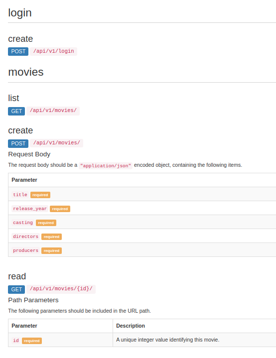
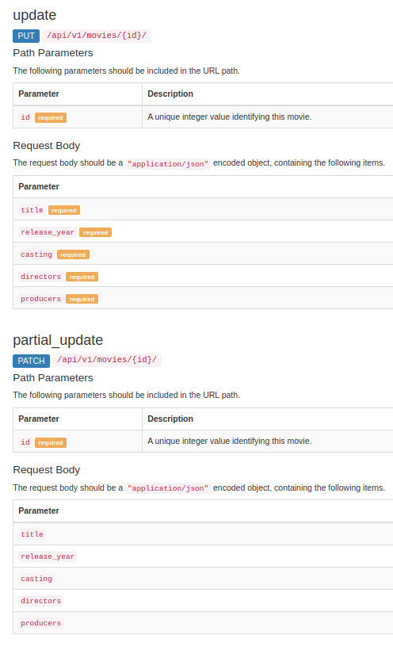
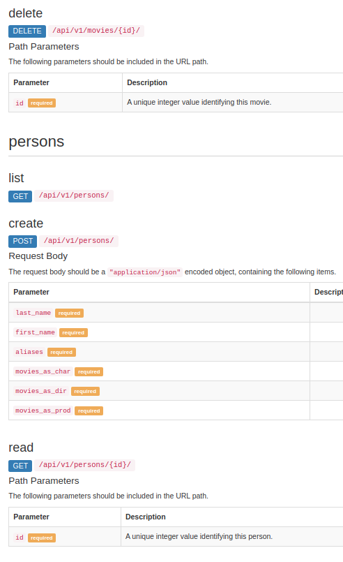
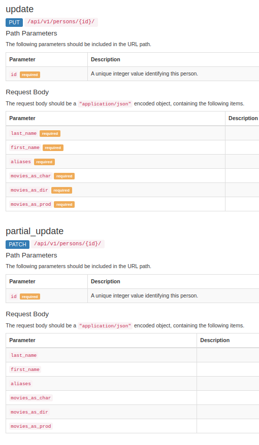
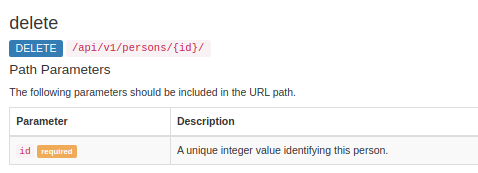

# API Movies and Persons

used libraries and frameworks:
- Django framework (I used this framework because is a full stack web framework and have a admin framework ready to use)
- Django REST Framework
(I used this because its updated regularly and generates HTML pages to browse and execute the API endpoints in development stage.) 
- coreapi (I used this dependency for the API documentation creator included with Django Rest framework)
- python-dotenv (I used this library for keeping the secret key and the enviroment configuration separeted in the server and the localhost)


## Installation:
``` 
pip3 install django 
pip3 install djangorestframework
pip3 install coreapi
pip3 install python-dotenv
```
## .env file
Create .env file in the root directory next to 
Generate a SECRET_KEY with this website:
https://djecrety.ir/
and after that write inside .env file:
``` 
SECRET_KEY = '<GENERATED SECRET_KEY>'
DJANGO_DEBUG = False
```
## Run migrations and run server
``` 
python3 manage.py makemigrations
python3 manage.py migrate
python3 manage.py runserver
```
## Interface:

In the root URL you will see Movies and Persons links to browse between them.
And in each list you will find the Actions: Create, Show, Edit, Delete

# API Documentation: 
The full documentation you can find in the root URL/docs:
```
http://127.0.0.1:8000/docs/
```
## Endpoint List

### Login
```
POST
/api/v1/login
```
### Movies
```
GET
/api/v1/movies/

POST
/api/v1/movies/

GET
/api/v1/movies/{id}

PUT
/api/v1/movies/{id}

PATCH
/api/v1/movies/{id}

DELETE
/api/v1/movies/{id}

```

### Persons
```
GET
/api/v1/persons/

POST
/api/v1/persons/

GET
/api/v1/persons/{id}

PUT
/api/v1/persons/{id}

PATCH
/api/v1/persons/{id}

DELETE
/api/v1/persons/{id}
```

## The Api Documentation:







